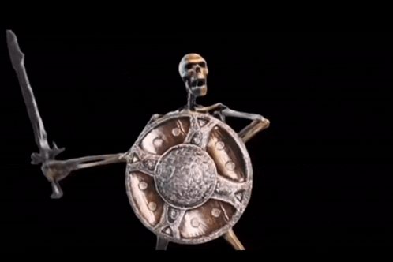
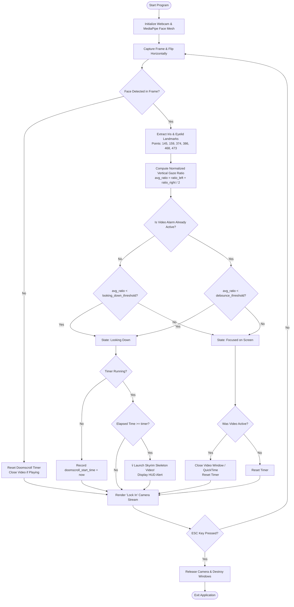

# 💀 Skeleton-Meme / Doomscroll Stopper

<p align="center">
  
  
  
  
  
  
</p>

<p align="center">
  
</p>

<p align="center">
  <b>🌐 Language / Idioma:</b><br>
  <a href="#-english"><b>English</b></a> •
  <a href="#-español"><b>Español</b></a>
</p>

---

## 🇬🇧 English

### 📌 About the Project

**Skeleton-Meme** is a computer vision productivity and anti-doomscrolling tool designed to catch you red-handed whenever you lose focus and stare down at your phone during work or study sessions.

By processing your webcam stream in real time with **OpenCV** and **MediaPipe Face Mesh**, the program precisely tracks iris coordinates and eyelid landmarks. If you cast your gaze downwards for more than a couple of seconds, it immediately interrupts your distraction by playing the iconic **Skyrim Skeleton** meme video!

> 🎓 **Student Note:**
> Hi there! I'm a **1st year DAW (Desarrollo de Aplicaciones Web / Web Application Development)** student. This project is a hands-on personal endeavor to explore and practice **Python**, computer vision, facial landmark tracking, and clean software architecture — simply built for fun and learning!

---

### ⚙️ How It Works (Technical Overview)

The tracking engine operates through a multi-stage computer vision pipeline:

1. **Video Capture & Preprocessing:**
   - Captures frames in real time from the webcam using `cv2.VideoCapture`.
   - Flips each frame horizontally to create a natural mirror perception.
   - Converts the frame colorspace from BGR to RGB for neural network inference.

2. **Facial Landmark & Iris Extraction:**
   - Employs **MediaPipe Face Mesh** with `refine_landmarks=True`, extracting 468 3D facial landmarks plus additional iris center points.
   - Extracts eyelid boundaries:
     - **Left Eye:** Lower eyelid (`#145`), Upper eyelid (`#159`).
     - **Right Eye:** Lower eyelid (`#374`), Upper eyelid (`#386`).
   - Extracts iris center points:
     - **Left Iris:** Landmark `#468`.
     - **Right Iris:** Landmark `#473`.

3. **Vertical Gaze Ratio Computation:**
   - Computes the vertical position of each iris relative to its upper and lower eyelids using the normalized ratio formula:
     $$\text{ratio} = \frac{y_{\text{iris}} - y_{\text{upper\_eyelid}}}{y_{\text{lower\_eyelid}} - y_{\text{upper\_eyelid}} + 10^{-6}}$$
   - Averages the left and right ratios:
     $$\text{avg\_ratio} = \frac{\text{ratio}_{\text{left}} + \text{ratio}_{\text{right}}}{2}$$
   - When looking straight ahead or up at the monitor, the ratio is high ($\approx 0.40 - 0.70$). When tilting eyes down towards a phone or lap, the ratio drops significantly ($< 0.25$).

4. **Temporal Grace Period & Hysteresis Debounce:**
   - **Grace Period (`timer = 2.0s`):** Looking down briefly or blinking will not trigger the alarm. The user must maintain a downward gaze continuously for at least 2.0 seconds.
   - **Hysteresis Debouncing (`debounce_threshold = 0.45`):** Once triggered, the video will not abruptly flicker on/off. The user must lift their gaze decisively back to the screen above the debounce threshold to dismiss the video.

5. **Cross-Platform Alarm Delivery:**
   - **Windows & Linux:** Plays `assets/skyrim-skeleton.mp4` seamlessly in an OpenCV popup window in an endless loop, automatically destroyed upon regaining focus.
   - **macOS:** Controls QuickTime Player natively via AppleScript (`osascript`) with floating dimensions.
   - **HUD Banner:** Renders a cyberpunk translucent warning banner on the main camera feed (`DOOMSCROLLING ALARM`).

---

### 🔄 Program Flowchart



---

### 💻 System Requirements

- **Operating System:** Windows 10/11, macOS, or Linux.
- **Python:** `3.9`, `3.10`, `3.11`, or `3.12` (MediaPipe is currently not compatible with Python 3.13+).
- **Hardware:** Standard USB or integrated webcam.

---

### 🚀 Setup & Installation

#### 1. Clone the repository
```bash
git clone https://github.com/Ignaciobrenas/Skeleton-Meme.git
cd Skeleton-Meme
```

#### 2. Create and activate a Virtual Environment
- **Windows (PowerShell):**
  ```powershell
  python -m venv venv
  .\venv\Scripts\Activate.ps1
  ```
- **macOS / Linux:**
  ```bash
  python3 -m venv venv
  source venv/bin/activate
  ```

#### 3. Install required dependencies
```bash
pip install -r requirements.txt
```

#### 4. Run the application
```bash
python main.py
```

*Press `ESC` on the camera window anytime to quit.*

---

### 🎛️ Configuration

You can fine-tune sensitivity variables at the beginning of the `main()` function in [`main.py`](file:///C:/Users/Ignacio/Desktop/Proyectos/Skeleton-Meme/main.py):

| Parameter | Default | Description |
| :--- | :---: | :--- |
| `timer` | `2.0` | Minimum continuous seconds looking down before activating the skeleton alarm. |
| `looking_down_threshold` | `0.25` | Gaze ratio cutoff to detect downward angle. Lower value = requires looking further down. |
| `debounce_threshold` | `0.45` | Gaze ratio required to turn off the video. Higher value = requires clearly looking up at the monitor. |

---

## 🇪🇸 Español

### 📌 Sobre el Proyecto

**Skeleton-Meme** es una herramienta de productividad y visión artificial diseñada para frenar el *doomscrolling* (perder el tiempo mirando el móvil) mientras trabajas o estudias en tu ordenador.

Utilizando la cámara web en tiempo real junto con **OpenCV** y **MediaPipe Face Mesh**, el programa analiza el ángulo vertical de la mirada mediante las coordenadas del iris. Si detecta que bajas la cabeza o la vista hacia el móvil durante más de 2 segundos, ¡el mítico meme del **Skyrim Skeleton** aparecerá en pantalla para llamarte la atención!

> 🎓 **Nota del Estudiante:**
> ¡Hola! Soy un estudiante de **1º de DAW (Desarrollo de Aplicaciones Web)**. Este proyecto lo he desarrollado como una práctica personal para investigar **Python**, visión por computador en tiempo real, seguimiento de rasgos faciales y control de flujos con Git, ¡simplemente por diversión y ganas de aprender!

---

### ⚙️ Cómo Funciona (Detalle Técnico)

1. **Captura y Preprocesamiento:**
   - La cámara web captura fotogramas de forma continua mediante `cv2.VideoCapture`.
   - Se voltea horizontalmente el frame para conseguir un efecto espejo natural.
   - Se realiza la conversión de espacio de color BGR a RGB para MediaPipe.

2. **Detección Facial y Puntos del Iris:**
   - **MediaPipe Face Mesh** analiza 468 puntos faciales tridimensionales con la opción `refine_landmarks=True`.
   - Se localizan los límites de los párpados:
     - **Ojo izquierdo:** Párpado inferior (`#145`), párpado superior (`#159`).
     - **Ojo derecho:** Párpado inferior (`#374`), párpado superior (`#386`).
   - Se extraen los centros del iris:
     - **Iris izquierdo:** `#468`.
     - **Iris derecho:** `#473`.

3. **Cálculo del Ratio de la Mirada:**
   - Se calcula la posición vertical relativa del iris respecto a los párpados:
     $$\text{ratio} = \frac{y_{\text{iris}} - y_{\text{párpado\_superior}}}{y_{\text{párpado\_inferior}} - y_{\text{párpado\_superior}} + 10^{-6}}$$
   - Al mirar al frente o a la pantalla, el valor oscila entre $0.40$ y $0.70$. Al mirar hacia abajo (móvil, teclado o regazo), el ratio desciende drásticamente por debajo de $0.25$.

4. **Temporizador de Gracia e Histéresis:**
   - **Margen (`timer = 2.0s`):** Un parpadeo o desviar la mirada un segundo no disparará la alarma. Se exige mirar hacia abajo durante 2 segundos ininterrumpidos.
   - **Histéresis (`debounce_threshold = 0.45`):** Evita que el vídeo se abra y cierre bruscamente si dudas con la mirada. Para quitar el vídeo debes levantar la vista con claridad.

5. **Reproducción Multiplataforma:**
   - **Windows y Linux:** Abre una ventana emergente nativa con OpenCV que reproduce en bucle continuo `assets/skyrim-skeleton.mp4` y se cierra automáticamente al mirar arriba.
   - **macOS:** Automatiza QuickTime Player mediante AppleScript (`osascript`).
   - **Banner HUD:** Dibuja un aviso translúcido en la cámara con la advertencia `DOOMSCROLLING ALARM`.

---

### 🚀 Puesta en Marcha e Instalación

#### 1. Clonar el repositorio
```bash
git clone https://github.com/Ignaciobrenas/Skeleton-Meme.git
cd Skeleton-Meme
```

#### 2. Crear y activar el entorno virtual
- **Windows (PowerShell):**
  ```powershell
  python -m venv venv
  .\venv\Scripts\Activate.ps1
  ```
- **macOS / Linux:**
  ```bash
  python3 -m venv venv
  source venv/bin/activate
  ```

#### 3. Instalar las dependencias
```bash
pip install -r requirements.txt
```

#### 4. Ejecutar el script
```bash
python main.py
```

*Para salir de la aplicación, pulsa la tecla `ESC` en cualquier momento dentro de la ventana de la cámara.*

---

### 🎛️ Parámetros de Configuración

Puedes ajustar la sensibilidad del programa modificando los valores al inicio de la función `main()` en [`main.py`](file:///C:/Users/Ignacio/Desktop/Proyectos/Skeleton-Meme/main.py):

| Parámetro | Valor por defecto | Descripción |
| :--- | :---: | :--- |
| `timer` | `2.0` | Segundos mínimos mirando hacia abajo para activar la alarma. |
| `looking_down_threshold` | `0.25` | Umbral para detectar mirada baja. Menor valor = requiere mirar más abajo. |
| `debounce_threshold` | `0.45` | Umbral para quitar la alarma. Mayor valor = exige mirar claramente a la pantalla. |

---

## 📄 License / Licencia

Distribuido bajo la Licencia **MIT**. Consulta el archivo [`LICENSE`](file:///C:/Users/Ignacio/Desktop/Proyectos/Skeleton-Meme/LICENSE) para más información.
